# Lightfield_and_Rendering

## Initials
In this section, we read the image and convert it to the 5 dimensional lightfield arrray, which contains 2 coordinates of aperture, 2 coordinates of the lenslet, and 1 number of channels. 

```matlab
img = imresize(imread('chessboard_lightfield.png'), 0.25);

u = 16;
v = 16;
s = size(img, 1) / u;
t = size(img, 2) / v;
c = 3;

uvstc = zeros(u, v, s, t, c);
uvstc = uint8(uvstc);
for i = 1:s
    for j = 1:t
        for x = 1:u
            for y = 1:v
                for z = 1:c
                    uvstc(x, y, i, j, z) = img(u*(i-1)+x, v*(j-1)+y, z);
                end
            end
        end
    end
end
```
These 5 variables will be used throughout the process

## Sub-aperture views
Sub-aperture views Rearranges the pixels in the light field image.
After setting lightfield variables from above, 2D mosaic is created from sub-apeture views.

```matlab
img_mosaic = uint8(zeros(u*s, v*t, c));
for i = 1:u
    for j = 1:v
        img_mosaic(s*(i-1)+1: s*(i-1)+s, t*(j-1)+1: t*(j-1)+t, :) = uvstc(i, j, :, :, :);
    end
end
```
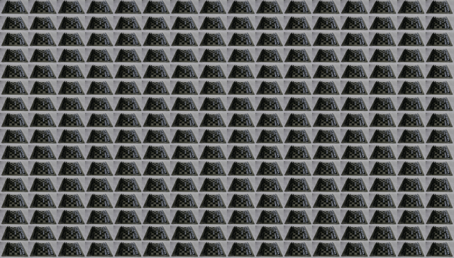

## Refocusing and focal-stack generation
Different scene is generated by refocusing at different depths.
```matlab
d = 21; % 0:0.1:2

focal_stack = uint8(zeros(s, t, c, d));

for d_ = 1:d
    focal_stack(:, :, :, d_) = combine_depth(uvstc, 0.1*(d_-1));
end

img_stack = zeros(s, t, c);
img_stack = uint8(img_stack);

for d_ = 1:d
    img_stack = focal_stack(:, :, :, d_);
end
```

```matlab
function [img_stacked] = combine_depth(img, d_)
    [u, v, s, t, c] = size(img);
    
    img = double(img);

    img_stacked = zeros(s, t, c);
    
    for i = 1:s
        for j = 1:t
            count = 0;
            for x = 1-u/2:u/2
                i_ = i + round(x*d_);
                for y = 1-v/2:v/2
                    j_ = j - round(y*d_);
                    if i_ <= s && i_ >= 1 && j_ <= t && j_ >= 1
                        for z =1:c
                            img_stacked(i, j, z) = img_stacked(i, j, z) + img(x+u/2, y+v/2, i_, j_, z);
                        end
                        count = count + 1;
                    end
                end
            end
            img_stacked(i, j, :) = img_stacked(i, j, :) / count;
        end
    end
    
    img_stacked = uint8(img_stacked);
end
```
<table>
    <tr>
        <th>0.0</th>
        <th>0.1</th>
        <th>0.2</th>
    </tr>
    <tr>
        <td>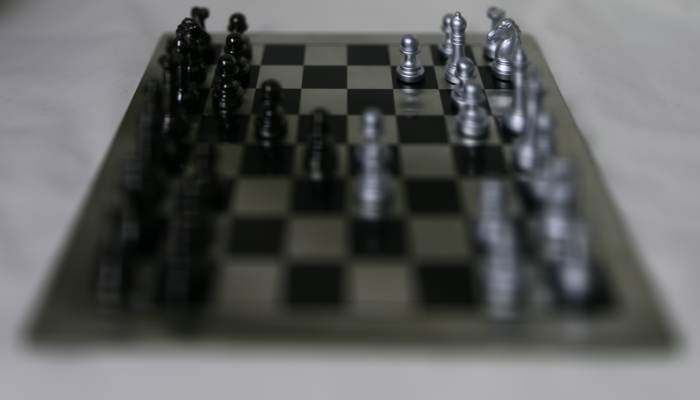</td>
        <td></td>
        <td></td>
    </tr>
</table>

<table>
    <tr>
        <th>0.3</th>
        <th>0.4</th>
        <th>0.5</th>
    </tr>
    <tr>
        <td>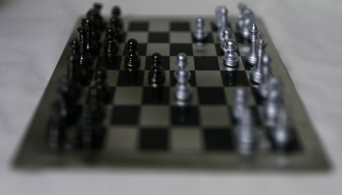</td>
        <td></td>
        <td></td>
    </tr>
</table>

<table>
    <tr>
        <th>0.6</th>
        <th>0.7</th>
        <th>0.8</th>
    </tr>
    <tr>
        <td>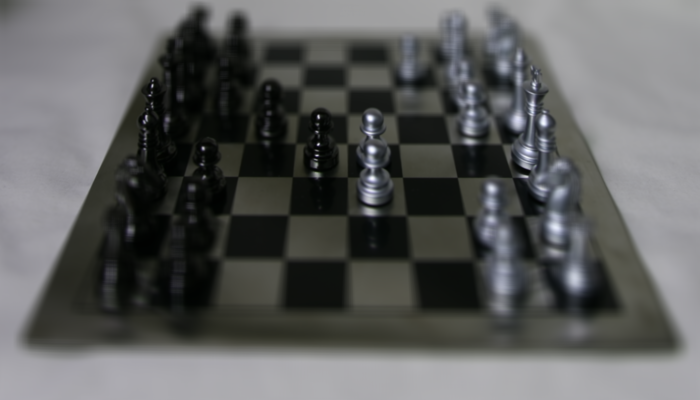</td>
        <td>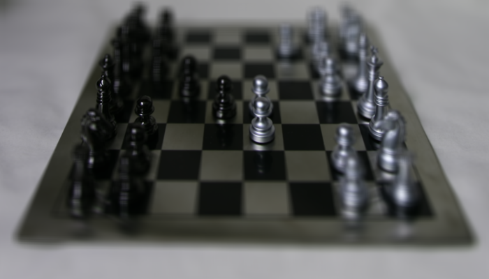</td>
        <td></td>
    </tr>
</table>

<table>
    <tr>
        <th>0.9</th>
        <th>1.0</th>
        <th>1.1</th>
    </tr>
    <tr>
        <td></td>
        <td>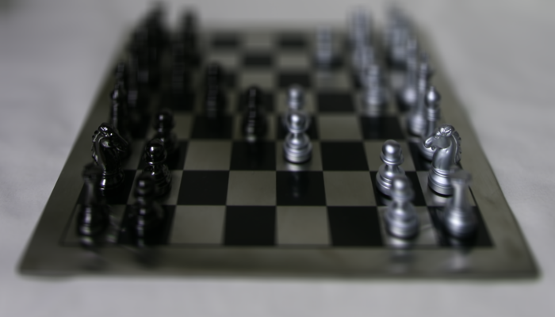</td>
        <td>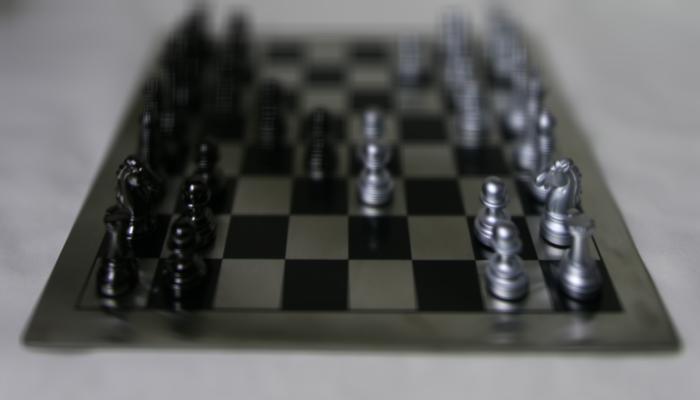</td>
    </tr>
</table>

<table>
    <tr>
        <th>1.2</th>
        <th>1.3</th>
        <th>1.4</th>
    </tr>
    <tr>
        <td>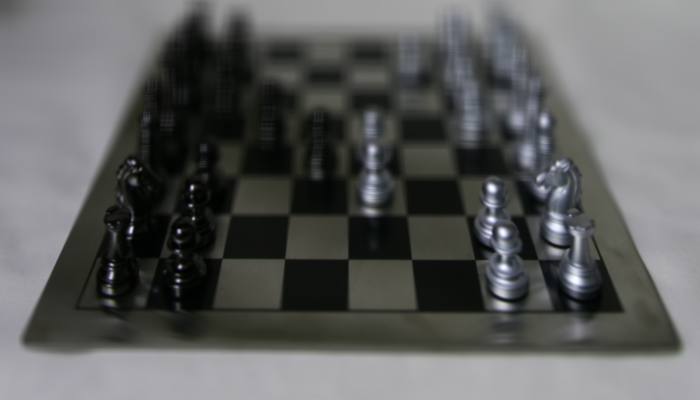</td>
        <td></td>
        <td></td>
    </tr>
</table>

<table>
    <tr>
        <th>1.5</th>
        <th>1.6</th>
        <th>1.7</th>
    </tr>
    <tr>
        <td></td>
        <td>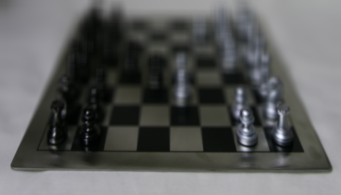</td>
        <td>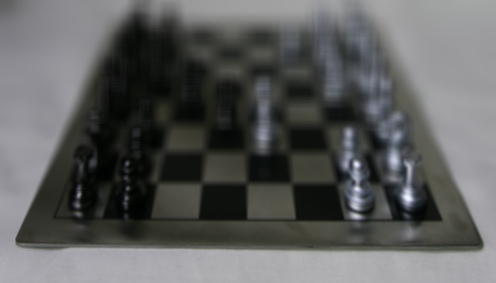</td>
    </tr>
</table>

<table>
    <tr>
        <th>1.8</th>
        <th>1.9</th>
        <th>2.0</th>
    </tr>
    <tr>
        <td></td>
        <td>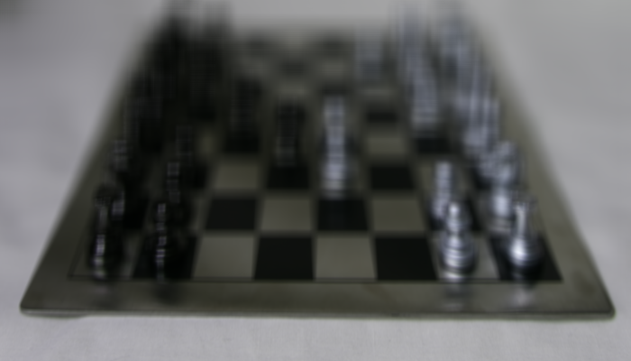</td>
        <td></td>
    </tr>
</table>

## All-focus image and depth from defocus
The images are merged to create an image that focuses all scene.
Focal_stack for each luminance, low, high, and sharpness are ca;ci;ated and `rgb2xyz` and `imguassfilt` are used to implement given tasks.
```matlab
focal_stack = double(focal_stack);

focal_luminance = zeros(s, t, d);
focal_low = zeros(s, t, d);
focal_high = zeros(s, t, d);
focal_sharp = zeros(s, t, d);

stdev_1 = 5;
stdev_2 = 5;

for d_ = 1:d
    img_stack = focal_stack(:, :, :, d_);
    
    % luminance
    img_stacked_xyz = rgb2xyz(img_stack, 'ColorSpace', 'srgb');
    img_stacked_lum = img_stacked_xyz(:, :, 2);
    focal_luminance(:,:,d_) = img_stacked_lum;

    % low
    img_combined_low = imgaussfilt(img_stacked_lum, stdev_1);
    focal_low(:,:,d_) = img_combined_low;

    % high
    img_combined_high = img_stacked_lum - img_combined_low;
    focal_high(:,:,d_) = img_combined_high;
    
    % sharpness
    img_combined_sharp = imgaussfilt(img_combined_high .^ 2, stdev_2);
    focal_sharp(:,:,d_) = img_combined_sharp;
end
```

The depth map image and image that focuses all parts of image is generated using the following code
```matlab
function [focus_all, depth_map] = generate_depth_map(focus_all, depth_map, focal_stack, focal_sharp, s, t, c)

for i = 1:s
    for j = 1:t
        sum_sharp = 0;
        for d_ = 1:7:d
            img_stack = focal_stack(:, :, :, d_);
            sharpness = focal_sharp(i,j,d_);

            for z = 1:c
                focus_all(i, j, z) = focus_all(i, j, z) + img_stack(i, j, z) * sharpness;
            end
            depth_map(i, j) = depth_map(i, j) + sharpness * 0.1*(d_-1);

            sum_sharp = sum_sharp + sharpness;
        end
        focus_all(i, j, :) = focus_all(i, j, :) / sum_sharp;
        depth_map(i, j) = depth_map(i, j) / sum_sharp;
    end
end

focus_all = uint8(focus_all);
depth_map = (1 - depth_map / 2);
end
```

<table>
    <tr>
        <th>all focused</th>
        <th>depth map</th>
    </tr>
    <tr>
        <td></td>
        <td>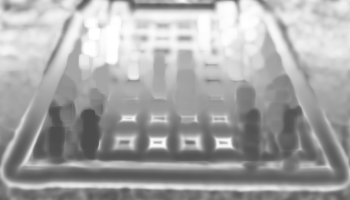</td>
    </tr>
</table>
